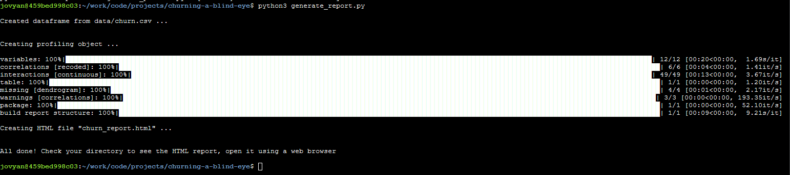

# Team Debrief

Hey team, as you may have noticed, the "data" folder that were operating on is missing from this repo as the Galvanize team has asked for it not to be shared. I did a little bit of prep yesterday so to get started with this repo, there are a couple steps.

    1. If you havent already, please grab the data folder from the "DATA" link below and put it into this repo's directory, it is already included in the .gitignore so don't worry about pushing and pulling
    
    2. To get a general sense of the data, go into your terminal and navigate to this folder, then run the "generate_report.py". This will create a Pandas-Profiling report that will give us a better sense of the data. It will output a file named churn_report.html, just open up the HTML file in your browser
       
    
[DATA](https://github.com/GalvanizeDataScience/supervised-learning-case-study)